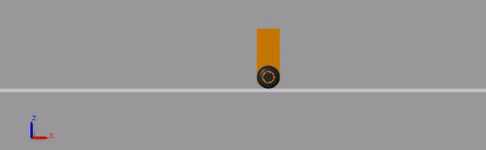

# Optimal LQG controller design for self-balancing robot

## LQG controller design process with MATLAB & Simulink®
**Control requirements:** follow a sinusoidal position reference with an 0.5m amplitude and 15s period remaining stable. 
The tolerance allowed is 1s in time and 10cm in position.

**[Formulation of plant model:](LinearAnalysis.m)**
- Euler-Lagrange equations
- Non-linear model state-space representation
- Non-linear model linearization around a fixed point
- LTI model state-space representation
- Sensor modeling: Quadrature encoder and IMU (Ref. MPU6050) with gyroscope and accelerometer

**[Full-state feedback design](ControllerDesign.m):** 
- Controllability analysis
- Manual pole placement
- Linear Quadratic Regulator (LQR) design
- Non-minimal phase system analysis

**[Full-state estimator design:](ControllerDesign.m)** 
- Observability analysis
- Manual estimator's pole placement
- Linear Quadratic Estimator (Kalman filter) design

## Mechanical model with Simscape Multibody™
In order to have a more reliable simulation, a mechanical model of the robot was implemented with Simscape Multibody™ (formerly SimMechanics™)  which provides a multibody simulation environment for 3D mechanical systems.

An automatically generated 3D animation provides a visualization of the system's dynamic.

| Following reference (LQR) | Disturbance rejection (LQR) |
|:-------------------------:|:---------------------------:|
|||

An interesting feature of this model is the wheel-floor contact model by using the external *Simscape Multibody Contact Forces Library*. The contact is modeled as a *sphere to plane force* and, as a small disclaimer, it's working but with a different behavior from the previous analysis. It's neccesary to tune the different parameters to make it works as supposed: Contact stiffness, contact damping, static and kinetic friction, etc. (If you find the parameters to make it works please make a pull request!).

## Contributing
Pull requests are welcome. For major changes, please open an issue first to discuss what you would like to change.

## Author and institution
Gonzalo Gabriel Fernández. Rodrigo Gonzalez (advisor). **Facultad de Ingeniería, Universidad Nacional de Cuyo**
